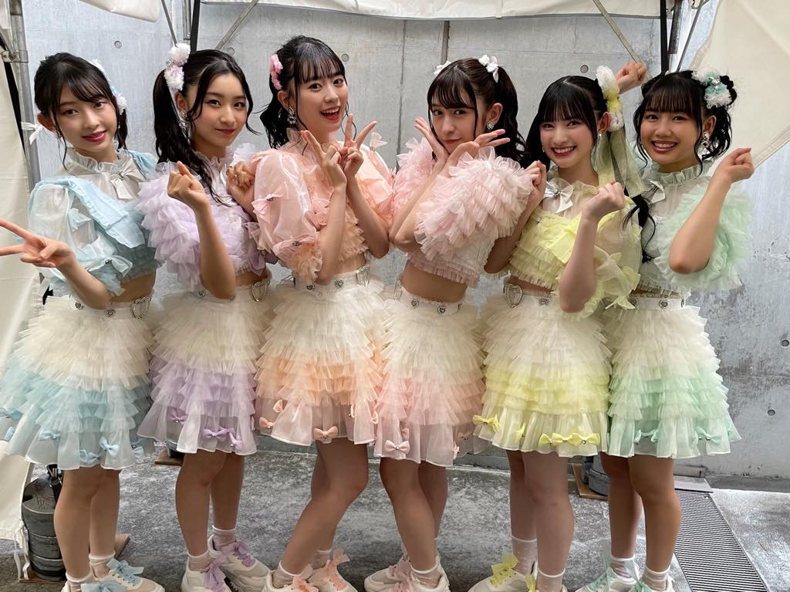
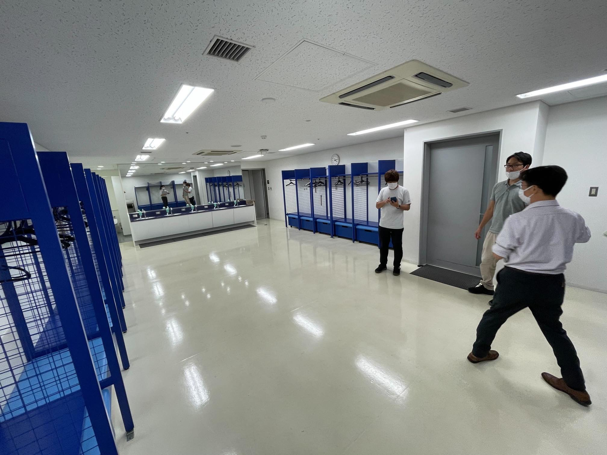

# 超ときめき♡LAN工事

投稿者: T氏

第18回日本スカウトジャンボリーで行われるジャンボリー大集会公式サポーターとして、[超ときめき宣伝部](https://toki-sen.com/) が就任した。彼女達は [TikTok](https://www.tiktok.com/@tokisen_official) を中心にバズりまくっている人気アイドルグループである。

そんな彼女達の控え室にネットワークと専用Wi-Fiを構築し、ライブ配信を陰で支えたデジタルインフラチームの活躍を紹介しよう。

## 「ネット必要だよなぁ」

(↑ 変な立ち方をしているのがT氏)

2022年6月28日(月)に直前の下見を実施。場所は思いっきりロッカールーム仕様の「控え室1」。
専用のバスルームやシャワーも完備している。が! 室内はケータイの電波が入らないことが判明!
警備関係のこともあり、ネットでバズっている彼女達が長時間ネットに接続できないとなると、大ブーイングが必死が予想される。
室内をよく調べると、壁コンにCat6のLANモジュールがあることを発見。「これならEPSから回線を分岐してもってくれば使えるんじゃね?」と軽く考えて控え室の下見は終了した。
今回の配信では光回線を会場設備MAXの3回線契約予定。業者と打合せしたところ配信業者さんが2回線、演出業者さんが1回線を要望。(この時点で回線売り切れじゃん...。まぁなんとかなるっしょ)

## 配線プラン

業者さんとの打合せを進めるうち、最終的に配信業者向けの2回線とZoom中継用の1回線で運用することが決定。
Zoom中継は原島君チームの管轄なので、こちらで制御が可能となった。
