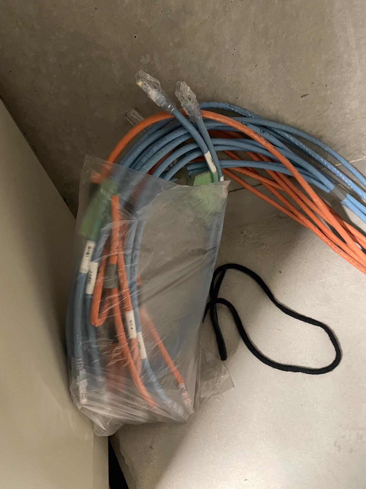
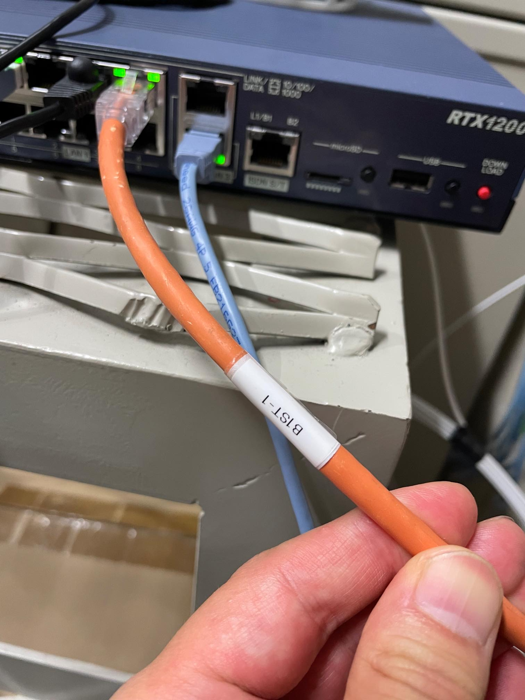
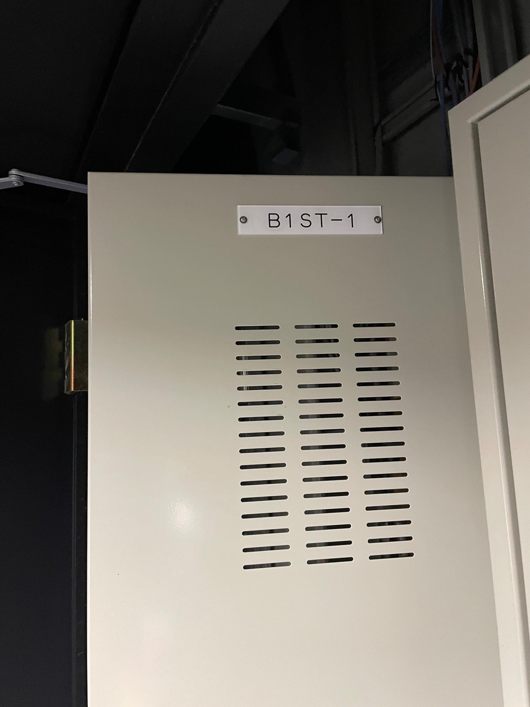
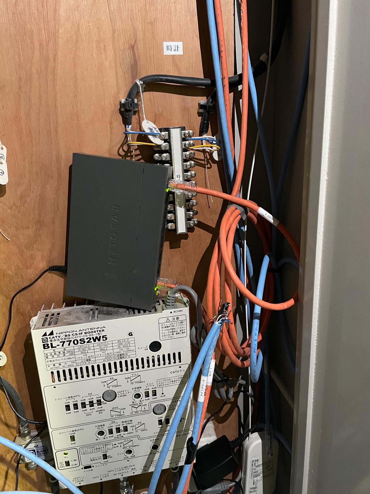
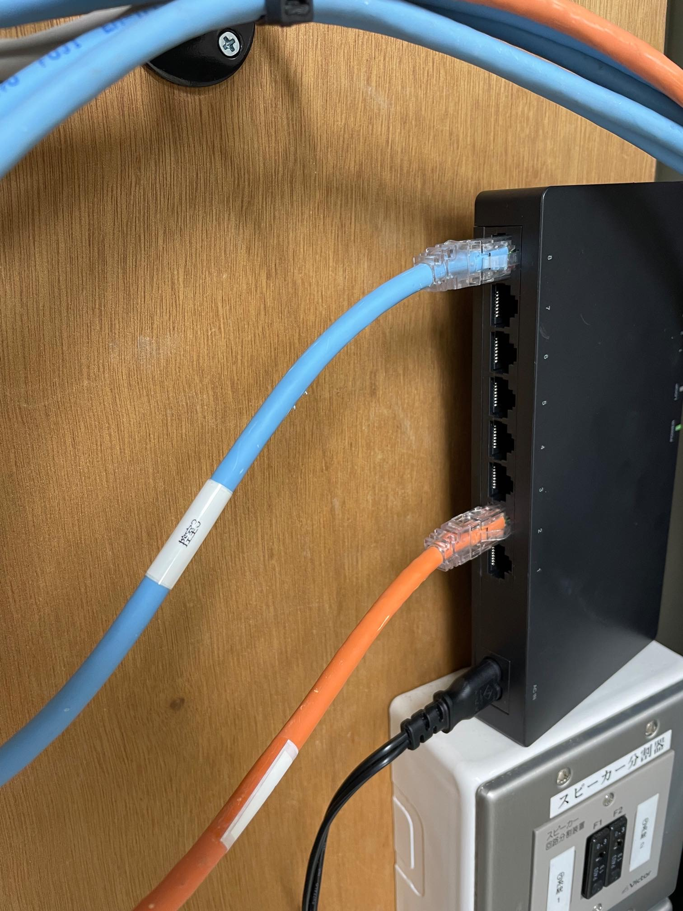
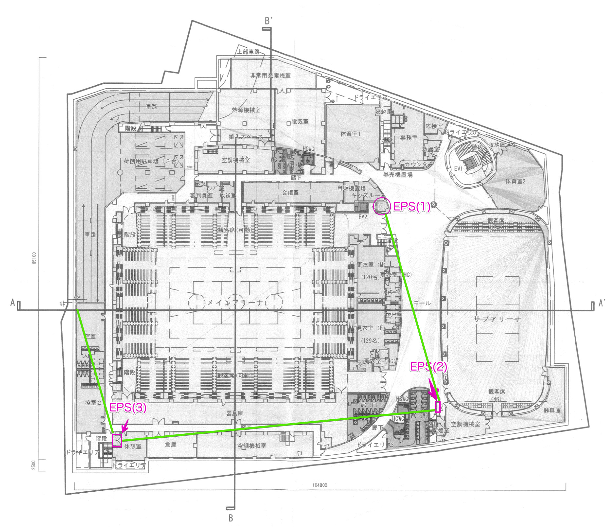
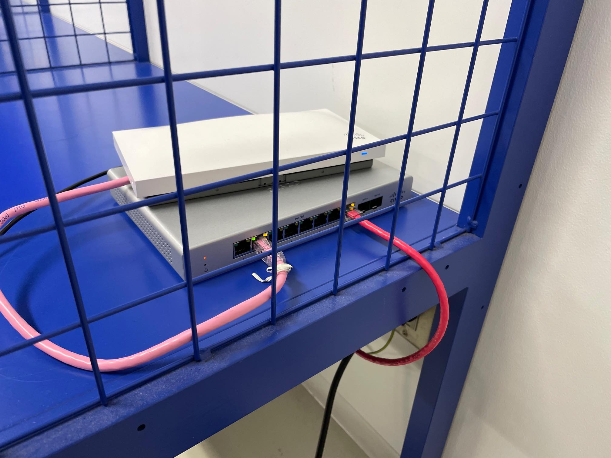
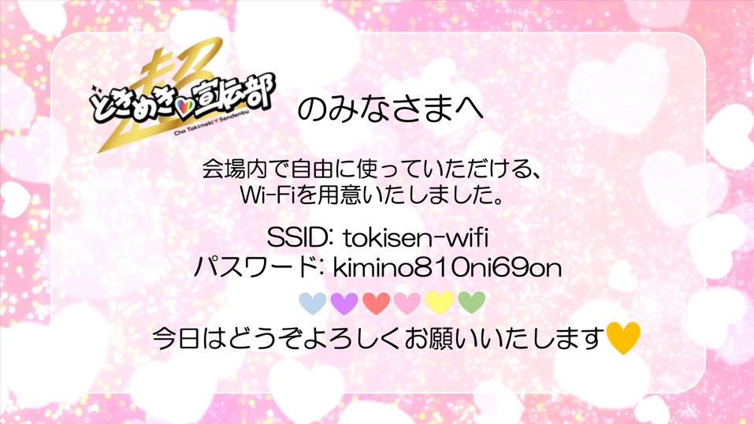

# 超ときめき♡LAN工事

寄稿: T氏

第18回日本スカウトジャンボリーで行われるジャンボリー大集会公式サポーターとして、[超ときめき♡宣伝部](https://toki-sen.com/) が就任した。彼女達は [TikTok](https://www.tiktok.com/@tokisen_official) を中心にバズりまくっている人気アイドルグループである。

そんな彼女達の控え室にネットワークと専用Wi-Fiを構築し、ライブ配信を陰で支えたデジタルインフラチームの暗躍を紹介しよう。

## ネット必要だよなぁ

(↑ 変な立ち方をしているのがT氏)

2022年6月28日(月)に直前の下見を実施。場所は思いっきりロッカールーム仕様の「控え室2」。専用のバスルームやシャワーも完備している。が! 室内はケータイの電波が入らないことが判明!

ネットでバズっている彼女達が長時間ネットに接続できないとなると、大ブーイングが必至。(警備関係のこともあり室内に滞在し続ける必要がある)
室内をよく調べると、壁コンにCat6のLANモジュールがあることを発見した。

「EPSから回線を分岐すれば使えるんじゃね?」と軽く考えて控え室の下見は終了した。

今回の配信では光回線を会場設備MAXの3回線契約予定。体育館自体は普段からイベント中継をやっていて、EPSもしっかりしている。年中業者が出入りして回戦の引き込み工事をやっているとのことだった。

業者と打合せしたところ配信業者さんが2回線、演出業者さんが1回線を要望。(この時点で回線売り切れじゃん...。まぁなんとかなるっしょ)

各控え室にはSoftbankやauの公衆wifiAPが設置してあったが、契約者でないと使いないとのこと。APのポートがキャップで塞がれていて、外せばLANを突っ込めそうだけどまぁ無理でしょう。

## 誰に聞けばいいんだ

「控え室2にLANモジュールはある。後はEPS内でLAN接続をすればいいだけのはず。」そう考えていた時期が僕にもありました。甘かった・・・
体育館に設備担当者がいるので電話で確認すると「いやー、そんなあるんですか? 知らないです。」と手応えが全くない。

**T氏**「配線図だけでもいいのでご確認いただけないでしょうか?」

**担当者**「うーん、いままでそんな事例がないのでわかりません。一番の古株スタッフも知らないと言ってるので。」

完全に突き放されて「設備担当者も知らないことをやらなきゃならんのか」と絶望状態に。

何か方法はあるはずだ、と信じて一端忘れることにする。

## 配線プラン

配信業者さんとの打合せを進めるうち、最終的に配信業者向けの2回線とZoom中継用の1回線で運用することが決定。
Zoom中継はHRSM君チームの管轄なので、デジタルインフラ班で制御が可能となった。

プロモ部で直接制御するために、EPS内に設置されたONUの直下に自前ルーター(RTX1200)を仕込み、そこからとき宣用とZoom用に分岐させる。

Zoom PCへの分岐は当初予定では持ち込みの自前ハブを想定していたが、フルノシステムズ様から提供をいただけるマネージドスイッチ(ACERA 9010-08)に担当してもらうことにした。(この配置転換が後に功を奏することとなる)

大集会部が施設の部屋割りを進める中、資料が回ってきたので確認すると当初「控え室2」だったのが「控え室1」に変更されている。(やばい。下見の時に控え室2は見てない・・・まぁ同じような構造だろうし、大丈夫やろ　とあまり気にしないことにした。)

## 一筋の光

大集会に合わせて2日前に回線工事を実施。NTTの委託業者が体育館に来てくれるので工事の立会に行ってきた。
工事自体はスムージに進んで完了。ベテランの風貌を漂わす作業員さんにダメ元で聞いてみることにした。

**T氏**「ある部屋に回線を分岐させて持っていきたいんですけど、何か分かりませんか?」

**おっちゃん**「んー、この辺ですかねー。」とLANケーブルの束を見つけてくれた!! 流石、経験値が違う。

ケーブル束には「会議室1」などのラベリングがしてあって、各部屋に分岐できそうな感じ。

「控え室1」とドンピシャで書いてあるラベルは見当たらないものの「1ST-1」とか「B1T-4」などのラベルは確認できたので、あとは差し換えてチェックしていけばいけるはず。

「1STは第1だから、控え室1に繋がるんじゃね?」くらいの思い込みで。(施設の設備員さんは「もう聞くなよ」オーラを出していたのでこれ以上は聞けない。)

この日は控え室1に立入ができないため、翌日の設営で試すことにした。仕事の先送りバンザイ。

## いざ配線

2022年8月7日 日曜日 大集会の当日。9:00体育館に突入して配線作業を開始。

配線作業は変態度数ではT氏の数倍上を行くJP氏が手伝ってくれて順調に完了。JP氏が配線の仕上げをしてくれているうちに、EPSに設置したRTX1200にプロバイダー情報を入れてネットの接続を開始した。

HRSM君からwifiの立ち上げを急かされていたのでEPS付近でひとまずのAPを起動させた。(wifiを求めていたスタッフが続々と接続を開始)

## つ、つながらねぇ・・・

JP氏の作業が落ち着いたのでこちらの作業に合流してもらう。T氏がEPSに留まり、JP氏が「控え室1」でリンクアップを目視で確認するという分担でいく。

ケーブル束のラベルを確認しながら次々に接続していくものの、全然リンクアップしない。(正常にLAN接続されるとハブのインジケーターが点灯するので目視でわかる)

ケーブルの被膜も固化してひび割れているものもあるので「経年劣化で断線してる?」などと嫌な予感が襲ってきた。(施設の担当者もこんな使い方したことないと言っていたし・・・)

## サタンJP降臨

前夜、不思議ドリンクを飲み干してサタン化したJP氏が覚醒する。「天井の配線を追っていったら別のEPSに入ってるっぽいんすよねー」

!!!

LANケーブルは100mを超えると伝送ができなくなるため、途中で中継をする必要があるのだ。中央EPSから「控え室1」までは100mを超えるため、途中のEPSを経由している疑惑がここで出てきた。

設備担当者に別室のEPSを開けてもらう。

ビンゴ! 中央EPSから伸びたLANケーブルが来ていて、更に別室へのLANケーブルもある。これを接続すればいけるはず!

ここまできてようやく「B1ST-1」の意味が判明する。各EPS内の配電盤の個別名称だったのだ。よくよく確認するとLANケーブルには各パネルと一致する名称が書かれていて、このことを示していたのだ。ただし「1ST-1 ?」とクエスチョンマークを付して人を不安に陥れる表記もあって、当時の担当者ですらよく分かっていないことが垣間見られた配線状況だった。

自前の8ポートハブを持ち込み、LANケーブルを接続した。slack通話をしつつ、再びJP氏に「控え室1」に向かってもらい、T氏は中央EPSでLANケーブルの抜き差し作業に取りかかる。

JP氏「んー、だめっすねー」。全てのLAN接続の組み合わせを試したがリンクアップしない・・・中継EPS内ではハブのリンクアップは確立しているので、配線が生きているのは間違いない。

「なんすかねー」と遺言を残し、サタンJPは旅立っていった。一人残されたT氏は再度LANケーブルのラベルを確認するものの、この時点でほぼ諦めかけていた。

しばらくするとJP氏が戻ってきた。「天井見てたら気になるところがあるんすよねー」と。例のオレンジ色の配線を追っていったらとある部屋(休憩室)に折れ曲がっているのが見えたらしい。

またまた設備担当者の方に休憩室内のEPSを解錠してもらい、LANケーブルを確認する。

あった!! **控室1** **控室2** **控室3** とラベリングしてあるLANケーブルがあった! (小躍りするT氏とJP氏)

くそー、こんなに中継してるのかよ。そのくらい施設側で把握しといてよ・・・しかも室内にEPSを配置してるとかわからんて!

自前の8ポートハブを設置して、それぞれLANケーブルを接続する。再度JP氏には「控え室1」に飛んでもらい、リンクアップを確認してもらう。

## ついにリンクアップ

slack通話でJP氏がつぶやく。「んー、こないっすねー」

いやいや、ちゃんとパネル名と一致してるケーブルと「控室1」のケーブルを挿してるやん。絶対間違いない。

ここのEPSには「控室1」〜「控室3」とラベルのある3本の接続先ケーブルが来ていて、今繋いでいるのは「控室1」のケーブルだ。念のため全ての回線をチェックすることにした。

「控室1」のケーブルを外して「控室2」を繋ぐもリンクアップせず。

本当に最後の1本に一縷の望みを託して「控室3」を挿す・・・**リンクアップ!!!**

おいおい、ラベリングすら間違ってるのかよ・・・。**控室3**を挿すと「控え室1」に繋がる。まぁ大田区ルールなのだろう。

こうして、ようやく、中央EPSからとき宣の「控え室1」までの配線が完了したのだった。

このようにEPS(1)だけの接続だけでは疎通せず、二箇所のEPS(2 & 3)で中継をすることでやっと開通することができた。

## シス子も活躍

「控え室1」にはCiscoのMeraki(MR-33とMS120-8P)を設置。シス子を経由してとき宣メンバーとスタッフさんに専用wifiを使ってもらうことができた。

リハーサルの映像をYouTubeでテスト配信していたため、その映像をスタッフさんがMacBook Proで再生しながらメンバーがフォーメーション確認などをやったそうだ。

そんなこんなで怒濤のLAN配線ミッションをこなしたのでした。無事に繋がってよかったよかった。

## おまけ

大集会部のKさん(とき宣ガチ勢)が作成したwifiアクセス情報。パスワードがイケてる(とき宣のキャッチフレーズになってる)。
