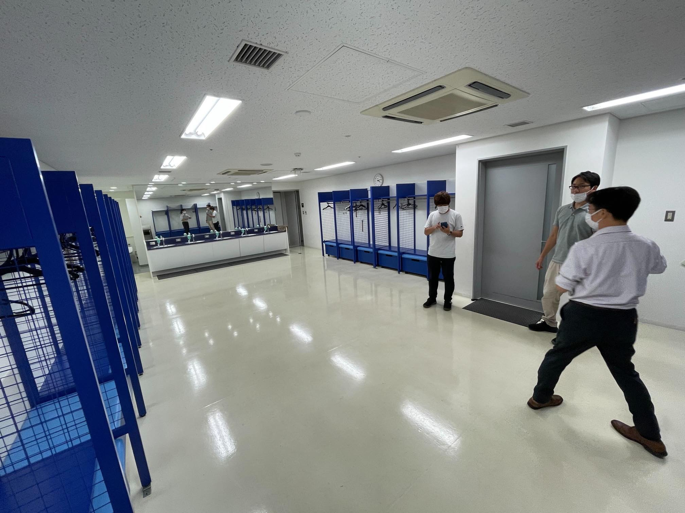
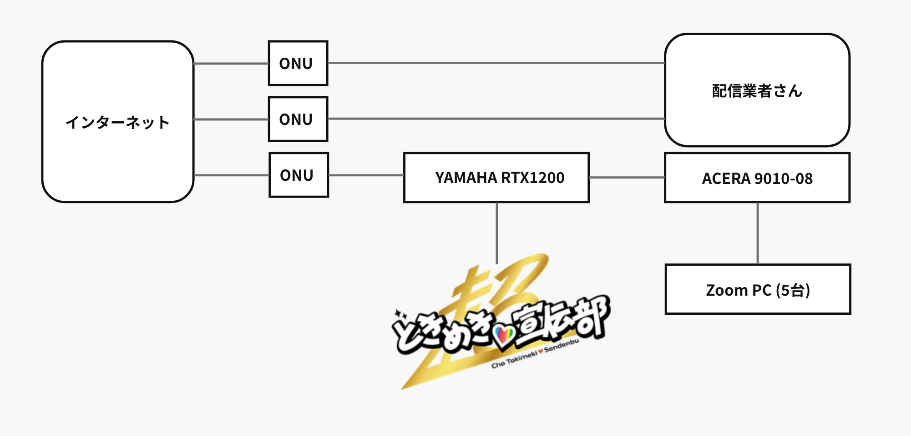

# 超ときめき♡LAN工事

寄稿: T氏

第18回日本スカウトジャンボリーで行われるジャンボリー大集会公式サポーターとして、[超ときめき♡宣伝部](https://toki-sen.com/) が就任した。彼女達は [TikTok](https://www.tiktok.com/@tokisen_official) を中心にバズりまくっている人気アイドルグループである。

そんな彼女達の控え室にネットワークと専用Wi-Fiを構築し、ライブ配信を陰で支えたデジタルインフラチームの暗躍を紹介しよう。

## ネット必要だよなぁ

(↑ 変な立ち方をしているのがT氏)

2022年6月28日(月)に直前の下見を実施。場所は思いっきりロッカールーム仕様の「控え室2」。専用のバスルームやシャワーも完備している。が! 室内はケータイの電波が入らないことが判明!

警備関係のこともあり、ネットでバズっている彼女達が長時間ネットに接続できないとなると、大ブーイングが必至。
室内をよく調べると、壁コンにCat6のLANモジュールがあることを発見。

「EPSから回線を分岐すれば使えるんじゃね?」と軽く考えて控え室の下見は終了した。

今回の配信では光回線を会場設備MAXの3回線契約予定。体育館自体は普段からイベント中継をやっていて、EPSもしっかりしている。年中業者が出入りして回戦の引き込み工事をやっているとのことだった。

業者と打合せしたところ配信業者さんが2回線、演出業者さんが1回線を要望。(この時点で回線売り切れじゃん...。まぁなんとかなるっしょ)

## 誰に聞けばいいんだ

「控え室2にLANモジュールはある。後はEPS内でLAN接続をすればいいだけのはず。」そう考えていた時期が僕にもありました。甘かった・・・
体育館に設備担当者がいるので電話で確認すると「いやー、そんなあるんですか? 知らないです。」と手応えが全くない。

**T氏**「配線図だけでもいいのでご確認いただけないでしょうか?」

**担当者**「うーん、いままでそんな事例がないのでわかりません。一番の古株スタッフも知らないと言ってるので。」

完全に突き放されて「設備担当者も知らないことをやらなきゃならんのか」と絶望状態に。

何か方法はあるはずだ、と信じて一端忘れることにする。

## 配線プラン

配信業者さんとの打合せを進めるうち、最終的に配信業者向けの2回線とZoom中継用の1回線で運用することが決定。
Zoom中継は原島君チームの管轄なので、デジタルインフラ班で制御が可能となった。

プロモ部で直接制御するために、EPS内に設置されたONUの直下に自前ルーター(RTX1200)を仕込み、そこからとき宣用とZoom用に分岐させる。

Zoom PCへの分岐は当初予定では持ち込みの自前ハブを想定していたが、フルノシステムズ様から提供をいただけるマネージドスイッチ(ACERA 9010-08)に担当してもらうことにした。(この配置転換が後に功を奏することとなる)

大集会部が施設の部屋割りを進める中、資料が回ってきたので確認すると当初「控え室2」だったのが「控え室1」に変更されている。(やばい。下見の時に控え室2は見てない・・・まぁ同じような構造だろうし、大丈夫やろ　とあまり気にしないことにした。)

## 一筋の光

大集会に合わせて2日前に回線工事を実施。NTTの委託業者が体育館に来てくれるので工事の立会に行ってきた。
工事自体はスムージに進んで完了。ベテランの風貌を漂わす作業員さんにダメ元で聞いてみることにした。

**T氏**「ある部屋に回線を分岐させて持っていきたいんですけど、何か分かりませんか?」

**おっちゃん**「んー、この辺ですかねー。」とLANケーブルの束を見つけてくれた!! 流石、経験値が違う。

ケーブル束には「会議室1」などのラベリングがしてあって、各部屋に分岐できそうな感じ。

「控え室1」とドンピシャで書いてあるラベルは見当たらないものの「1ST-1」とか「B1T-4」などのラベルは確認できたので、あとは差し換えてチェックしていけばいけるはず。

「1STは第1だから、控え室1に繋がるんじゃね?」くらいの思い込みで。(施設の設備員さんは「もう聞くなよ」オーラを出していたのでこれ以上は聞けない。)

この日は控え室1に立入ができないため、翌日の設営で試すことにした。仕事の先送りバンザイ。

## 配線して敗戦

2022年8月7日 日曜日 大集会の当日。9:00体育館に突入。