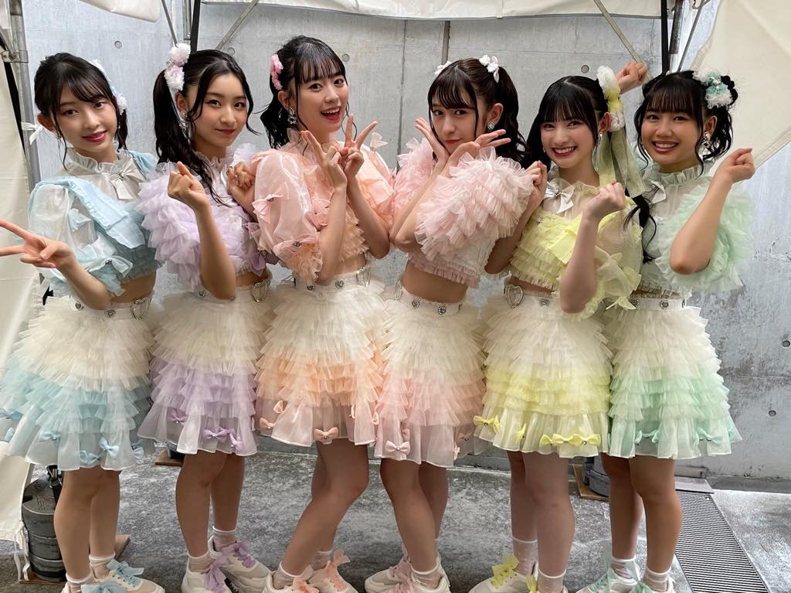
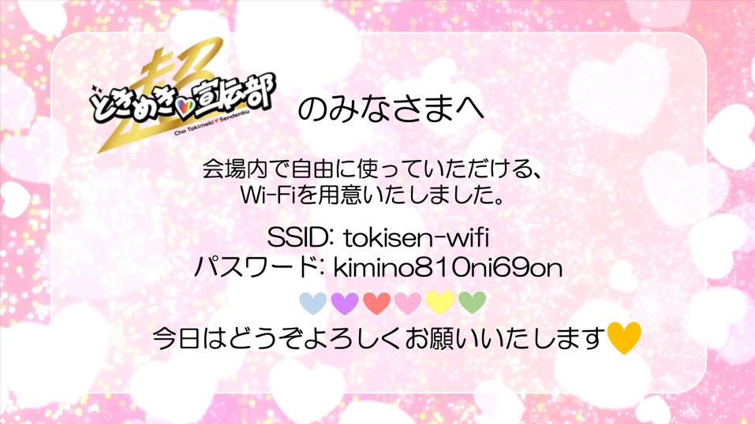

# 超ときめき♡LAN工事

寄稿: T氏

ジャンボリー大集会公式サポーターとして、[超ときめき♡宣伝部](https://toki-sen.com/) が就任した。彼女達は [TikTok](https://www.tiktok.com/@tokisen_official) を中心にバズりまくっている人気アイドルグループである。

「ロックオンされちまったぜ・・・」という声もちらほら聞きますが、皆さん、推しは決まりました?

そんな彼女達の控え室に専用ネットワークとWi-Fiを構築し、ライブパフォーマンスを陰で支えたデジタルインフラチームの暗躍を紹介しよう。

彼女達の控え室の壁にはLANコネクタがあるものの、完全に死んでいて使えない。体育館の担当者に聞いてみたものの「そんな使用例は過去にないから分からない」と完全に突き放された状態からスタートした。

当初は基幹の配線パネルから各部屋に伸びるLANケーブルを接続するだけでイケるだろう、と考えていたのだが全然だめ。

試せることは全て試したが接続ができない・・・。

半ば諦めかけていたその時、前夜に不思議ドリンク(サタンフレーバー)を飲み干したJP氏が覚醒したのだった! 体育館の廊下天井に這い巡らされたLANケーブルを辿り、中継箇所と思われる配線パネルを次々と特定したのだ!

施設の担当者に何度も頭を下げて機械室を開けてもらい、自前のハブ(僕らは羽生九段と命名)を設置してLANケーブルを接続しまくったのだった。

最後の関門が訪れる。「控室1」〜「控室3」とラベルのある3本の接続先ケーブルが来ていて、**とき宣**の控え室 = 「控室1」のケーブルを繋ぐがリンクアップしない・・・何故だ!

僕らは念のため全ての回線をチェックすることにした。「控室1」のケーブルを外して「控室2」を繋ぐもリンクアップせず。

本当に最後の1本に一縷の望みを託して「控室3」を挿す・・・**リンクアップ!!!**

おいおい、ラベリングすら間違ってるのかよ・・・。**控室3**を挿すと「控え室1」に繋がる。まぁ大田区ルールなのだろう。

こうして、ようやく、**とき宣**の「控え室1」までの配線が完了したのだった。接続したときはめっちゃときめいた♡。

「控室」にはシス子(Cisco)のMeraki(MR-33とMS120-8P)を設置。シス子を経由して**とき宣**メンバーとスタッフさんに専用wifiを使ってもらうことができた。

リハーサルの映像をYouTubeでテスト配信していたため、その映像をスタッフさんがMacBook Proで再生しながらメンバーがフォーメーション確認などをやったそうだ。

数多の難関を乗り越えてLAN配線 & wifi提供の最重要ミッションをこなしたのでした。無事に繋がってよかったよかった。

## おまけ

大集会部のKさん(とき宣ガチ勢)が作成したwifiアクセス情報。パスワードがイケてる(とき宣のキャッチフレーズになってる)。

なおT氏は「とき宣はインフラだ!」などと意味不明なことを話しており、当局より任意で事情聴取を受けているとのことだった。

## 完全版

技術的なことも含め、詳細を記した完全版は[github](https://github.com/caffisenna/18nsj-ura/blob/master/tokisen/index.md)で公開しているので、興味のある方は見てみてください!